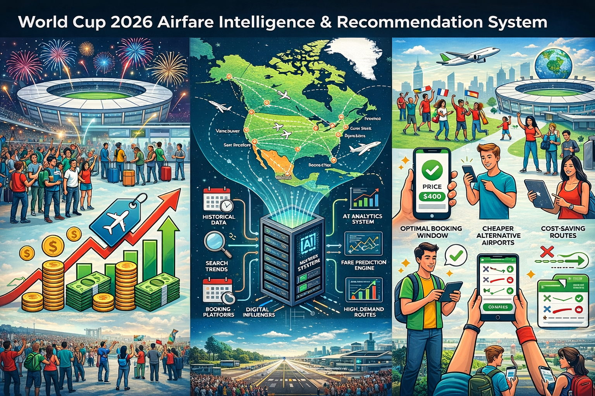

# ✈️ World Cup Airfare Intelligence System

<p align="center">


</p>

<p align="center">


</p>

<p align="center">
  <strong>Real-Time Airfare Intelligence for World Cup Travel</strong><br>
ML-powered booking recommendations, route analytics, and fare trend prediction.

</p>


</div>

> **What if you could predict airfare spikes before they happen — and tell travelers exactly when to book?**
>
> This system ingests real-time flight pricing data across multiple high-demand travel routes, processes it through a layered analytics pipeline, and delivers ML-driven booking recommendations through an interactive React dashboard.
> 


## 🧠 What This System Does

The system answers three core business questions:

| Question | System Component |
|---|---|
| *What are flights costing right now?* | Real-time Amadeus ingestion pipeline |
| *How will prices change in the next 30 days?* | XGBoost fare prediction model |
| *Should I book now or wait?* | Rule-based + ML booking recommendation engine |

---

## 🏗️ Architecture


## 🔄 Data Pipeline: Bronze → Silver → Gold

Built using a Bronze → Silver → Gold architecture inspired by modern analytics platforms.

🥉 **Bronze — Raw Ingestion**  
Stores append-only API responses with full historical traceability.

🥈 **Silver — Cleaned & Enriched**  
Standardizes fares, removes duplicates, and engineers booking intelligence features.

🥇 **Gold — Analytics & ML Ready**  
Delivers aggregated pricing metrics and optimized datasets powering the dashboard, recommendation engine, and ML models.

---

## 🤖 ML Model: Fare Prediction & Booking Intelligence

### Fare Prediction — XGBoost Regressor

Predicts airfare prices for a given route, airline, and departure window, then converts those predictions into traveler-facing booking recommendations.

**Feature set:**
- Days before departure
- Route
- Airline code
- Number of stops
- Departure date and month
- Flight duration
- Search date timing
- Historical route-level fare patterns

**Training approach:**
- Trained on collected airfare snapshots from the data pipeline
- Uses engineered time-based and route-based features
- Evaluated with regression metrics such as MAE and R²
- Generates predicted fare movement to support booking decisions

**Prediction outputs:**
- Estimated airfare price
- Route-level price trend
- Buy now vs. wait recommendation
- Cheaper alternative route signal

```text
Airfare Snapshots
        ↓
Feature Engineering
        ↓
XGBoost Regressor
        ↓
Fare Prediction
        ↓
Booking Recommendation
```


### Booking Recommendation Engine

Combines airfare predictions with route-level pricing signals to generate simple traveler-facing booking recommendations.

| Recommendation | Logic |
|---|---|
| **Book Now** | Current fare is relatively low and predicted prices are increasing |
| **Wait** | Current fare appears expensive and predicted prices remain stable or decline |
| **Monitor** | Price trend is unclear or route volatility is moderate |
| **Consider Alternative Route** | Similar nearby routes show lower predicted fares |

---

## 📊 Dashboard

Built with **React + Vite** to surface real-time airfare intelligence through interactive analytics and booking insights.

### Core Views

| View | Description |
|---|---|
| 🌍 **Route Explorer** | Compare live airfare trends across travel routes |
| 📈 **Fare Prediction** | Visualize projected airfare movement and pricing trends |
| 🧠 **Booking Signal** | ML-driven recommendation engine for booking decisions |
| 🔎 **Route Intelligence** | Discover lower-cost and alternative route options |

```text
Real-Time Flight Data
          ↓
Analytics Pipeline
          ↓
ML Prediction Engine
          ↓
Interactive React Dashboard
```

## 📁 Project Structure

```
worldcup-airfare-intelligence/
│
├── README.md
├── LICENSE
├── .gitignore
├── requirements.txt
├── worldcup-airfaire-intelligence.png
│
├── data/
│   └── ...                  # Raw and processed airfare datasets
│
├── src/
│   ├── ingest/
│   │   ├── fetch_flight_amadeus.py
│   │   └── ...              # API ingestion and loading scripts
│   │
│   ├── ml/
│   │   └── ...              # Fare prediction and forecasting models
│   │
│   ├── recommendation/
│   │   └── ...              # Booking recommendation logic
│   │
│   └── ui/
│       └── app.py           # Backend / dashboard integration logic
│
├── airfare-ui/
│   ├── public/
│   │   └── ...              # Static assets and icons
│   │
│   ├── src/
│   │   └── ...              # React dashboard components and pages
│   │
│   ├── package.json
│   ├── package-lock.json
│   ├── vite.config.js
│   └── index.html
│
└── .env                     # Local environment variables (ignored)
```
---

## 👤 Author

**Thinh Nguyen**

Data Engineer/ Analytics Engineer/ Data Scientist

---

<div align="center">

*Built with ☕ and a lot of `pandas` DataFrames during the World Cup hype cycle.*

</div>

